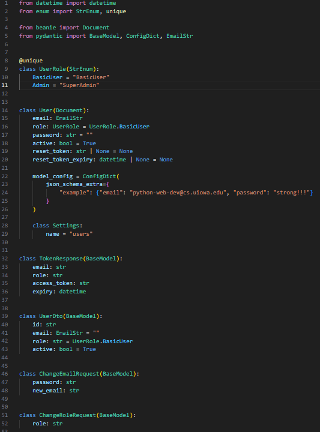
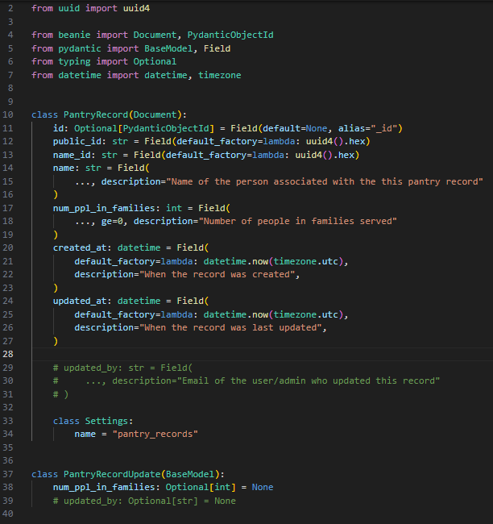
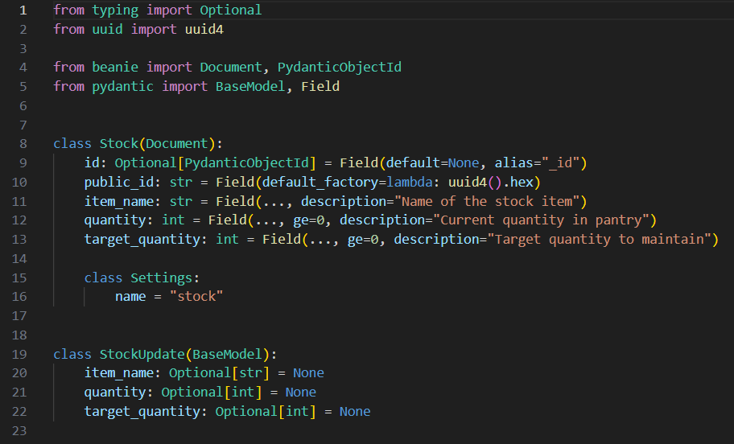
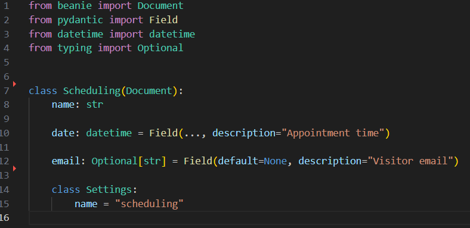
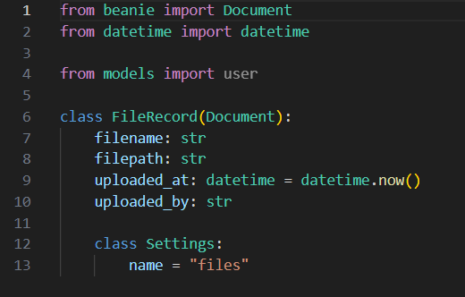

# cs-3980-ic-compassion-food-pantry-application

## Project Description

Talk about IC Compassion application goals and stuff here


## Overview

This backend powers the Food Pantry Management System, providing APIs for:

- User authentication & authorization
- Pantry record tracking
- Inventory (stock) management
- Scheduling system
- File upload/download system

Built with FastAPI, MongoDB, and Beanie, it follows a router-based architecture.

## Tech Stack
- Framework: FastAPI
- Database: MongoDB
- Object-Document Mapper: Beanie (with Motor and Pydantic)
- Auth: JWT (JSON Web Tokens)
- Server: Uvicorn

## Set Up

After cloning this repository, create a virtual environment in your local project folder. Enter the following terminal command:

```
python -m venv venv
```

To activate the venv, run the following command on MacOS:

```
source venv/bin/activate
```

Or, on Windows, run:

```
.\venv\Scripts\activate
```

Next, it should be noted project uses FastAPI and Uvicorn. All necessary libraries are listed in `requirements.txt`. To install them, run the following command:

```
pip install -r requirements.txt
```
## FRONTEND

## BACKEND
### Folder Structure
backend/<br>
│── auth/  # Authentication (JWT, password hashing)<br>
│── models/                # Beanie models (User, PantryRecord, etc.)
<br> 
│── routers/              # API route handlers<br>
│── database.py           # MongoDB connection setup<br> 
│── main.py                # FastAPI app entry point<br>
│── tests/                # Pytest test suite<br> 
│── uploads/               # Stored uploaded files<br>


### Authentication
Uses JWT-based authentication. Token must be included in headers: Authorization: Bearer <access_token> <br>
Roles:
- BasicUser – standard user access
- SuperAdmin – full system access (admin privileges)

### API Models

Users <br>


Pantry Records


Stock


Scheduling


Files<br>



### API Routes
Stored as collections in our food_pantry_db

Authentication
- Users can sign up and sign in
- Users can access only their own account 
- Users can change password only when signed in
- Users can get an email sent to them to reset their password and update it

<br> 

Users
- Change email (authenticated, user can only change their own)
- Get current user (authenticated, user can only change their own)
- Admin: view all users (authenticated, only admin can view all)
- Admin: update user roles (authenticated, only admin can view all)

<br>

Pantry Records (admin only access)
- Create pantry visit records
- View all records
- Update records
- Delete records

<br>

Stock (admin only access)
- Track inventory items
- Create new stock entries
- Update quantities
- Delete stock entries

<br>

Scheduling
- Users schedule appointments (can only schedule appointments for themselves)
- Users view their own schedule (/me)
- Admin: view all schedules
- Admin: update schedules 
- Admin: delete schedules


<br>

Files
- Users can only upload files when signed in 
- Users can view and download files when signed in 
- Users can delete their own files
- Admin: upload files (visible in all accounts)
- Admin: can delete any file

## MAJOR FEATURES